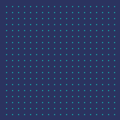
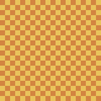

# pyxel-utils

Various utilities for game development with the [pyxel](https://github.com/kitao/pyxel) engine.

### `blt_topleft`

Similar to `pyxel.blt`, but always places the image so that the top-left
corner of the image is at the given x, y position.

Does not support the `rotate` parameter.

### `text_centered`

Draws text horizontally centered at the given x, y position.

### Cursor showing coordinates

Shows the current mouse coordinates under the cursor.

Usage:

```python
import pyxel_utils

def update():
    pyxel_utils.cursor_update()
    ...

def draw():
    ...
    pyxel_utils.cursor_draw()
```

### `point_grid`

Draws a grid of points.



Usage:

```python
import pyxel_utils

def draw():
    pyxel_utils.point_grid(10, 10, 3)
```

### `checkerboard`

Draws a checkerboard pattern.



Usage:

```python
import pyxel_utils

def draw():
    pyxel_utils.checkerboard(5, 9, 10)
```
